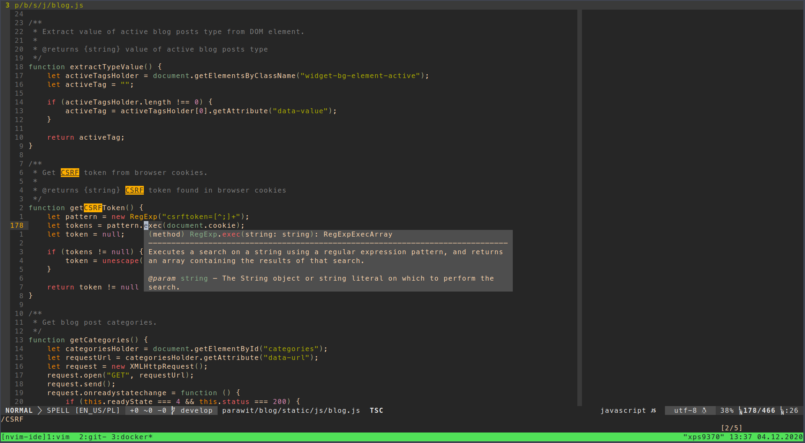
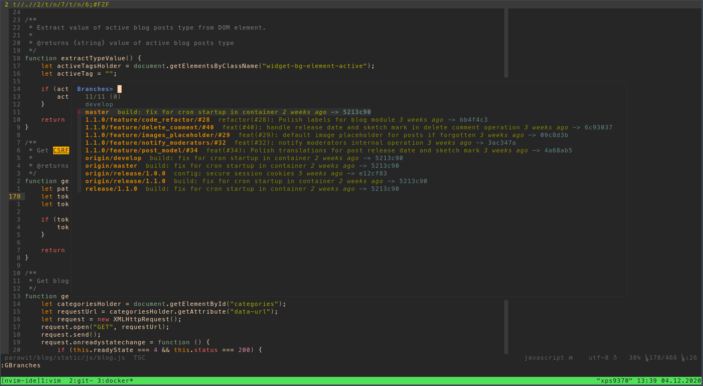
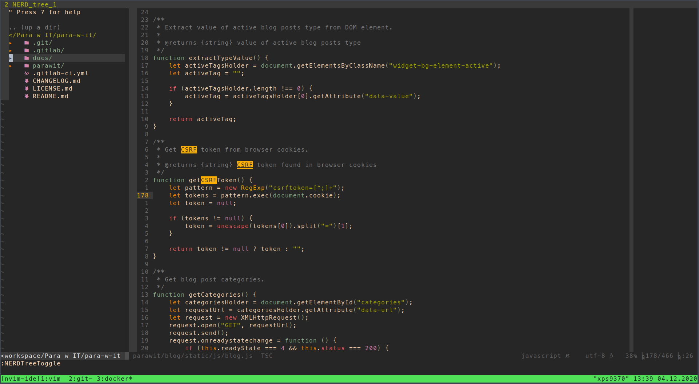

# Neovim IDE

Neovim as IDE in Docker container. The idea is to create comfy programming environment for various languages with usage
of Docker. On host machine there should be the least of dependencies connected with development environment. Only Docker
should be required, so development environment can be used on any computer - work, private or even VPS. Base image will
contain Git and Neovim installation with basic configuration for itself and extensions like file explorer, Git 
integration, support for files like JSON, HTML, CSS, etc. From base image there will be created images for specific 
programming languages, so base configuration will be extended per programming language.

All images build with this repository will be available on [Docker Hub](https://hub.docker.com/u/mashmb).

<p align="center">
  
</p>

<p align="center">
  
</p>

<p align="center">
  
</p>

## Images

Detailed images description (every directory matches single image, directory name represents image name).

How to run image? For testing it could be:

```shell
docker run -it mashmb/nvim:[tag] /bin/bash
```

For work suggested is **docker-compose.yml** file where configuration will be more tidy. Programming projects should
be mounted from host to **/root/workspace/** directory:

```yml
version: '3.8'

services:
  nvim:
    image: mashmb/nvim:[tag]
    deploy:
      replicas: 1
      resources:
        limits:
          memory: 2G
    volumes:
      - [path_to_projects]:/root/workspace
```

### nvim

Base Neovim image. Software installed:

1. **curl** - for downloading stuff
2. **fzf** - for fast files search
3. **ripgrep** - for fast text occurrence search
4. **Git** - Git support inside container
5. **tig** - Git visualization inside terminal
6. **xclip** - clipboard handling
7. **Python 3** - for proper Neovim work
8. **pip** - for Python 3
9. **NodeJS** - for proper Neovim work
10. **npm** - for NodeJS
11. **tzdata** - for default container timezone settings

All components for Neovim are installed (pynvim with pip and neovim with npm).

Image contains general settings and some key bindings for Neovim (saved in **/root/.config/nvim/general/**).

Spell check for English and Polish is added.

Europe/Warsaw as default timezone.

Extensions are managed by Vim Plug. Installed and configured extensions:

1. Gruvbox theme
2. Airline status bar
3. Files tree (with Git integration and icons pack)
4. Welcome screen
5. Fuzzy finder (search for file and text occurrence)
7. Git integration
8. Hex colors preview support (disabled by default)
9. Conquer of completion:
    - Code completion
    - Code documentation
    - Symbols and references highlighting
    - Code formatting
    - Code actions (optimize imports, generate, etc.)
    - Project scope renaming
    - Go to definition
    - Go to type definition
    - Go to implementation
    - Go to declaration
    - References
    - Quick fix
    - Code diagnostics
    - Code outline
    - Symbols search
9. Debugger

Supported languages:

1. CSS
2. HTML
3. JavaScript
4. JSON
5. SH
6. SQL
7. YAML

### nvim-go

Image dedicated for Go development. It is overriding the base **nvim** image. Conquer of completion is realized with:

- coc-go
- gopls

Image has configured debugger for Go development with usage of **vimspector** (required **Delve** is installed also).
